# 개요
대학교 점심시간에 음악을 1시간 가량 틀어주는데 음악을 선정할 때 재학생들이 직접 신청하여 참여 할 수 있게 만든 웹 사이트 

노래 검색은 총 3가지로 제목 검색, 앨범 검색, 가수 검색 으로 검색 할 수 있다.

# 기술아키텍처
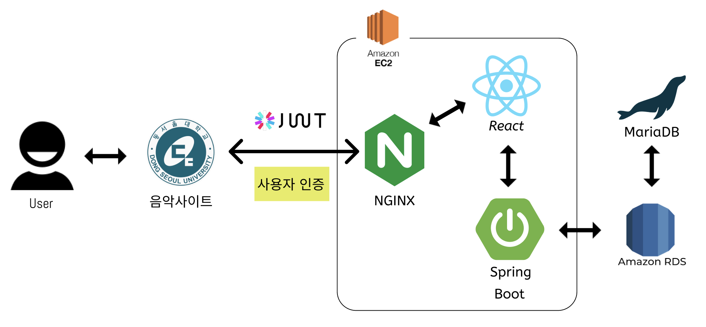

# 기술스택
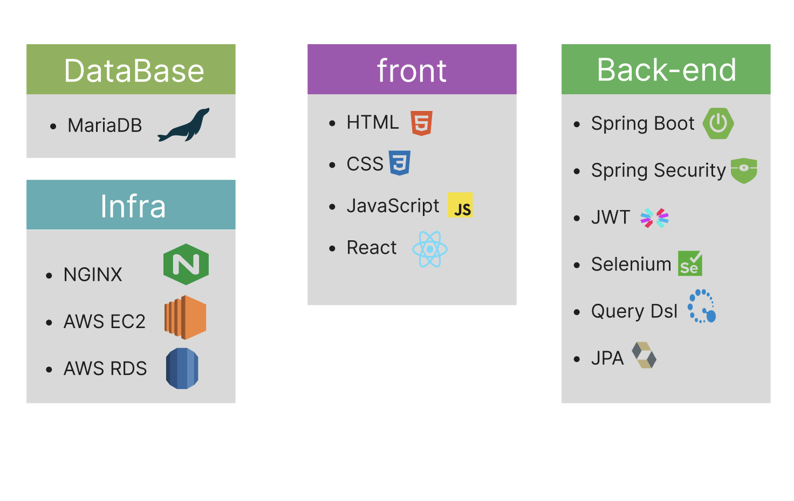

원래 목적은 음악 API를 통해 노래를 가져오려고 했지만 국내 사이트 에서는 별도의 API를 제공해주지 않아서 크롤링을 선택했고 지니뮤직에서 직접 크롤링을 통해 노래 정보를 가져옴
자바11 , 스프링 2.7.xx, 구글 버전 -> 104.0.5112.102

# ERD 설계
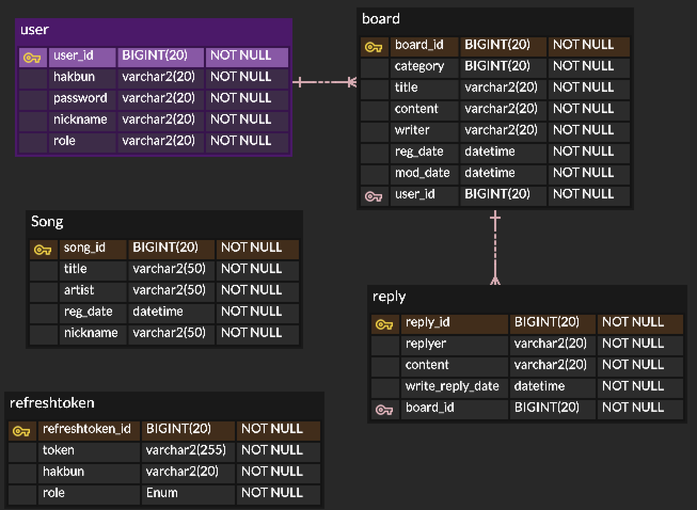

# 요구사항 명세서

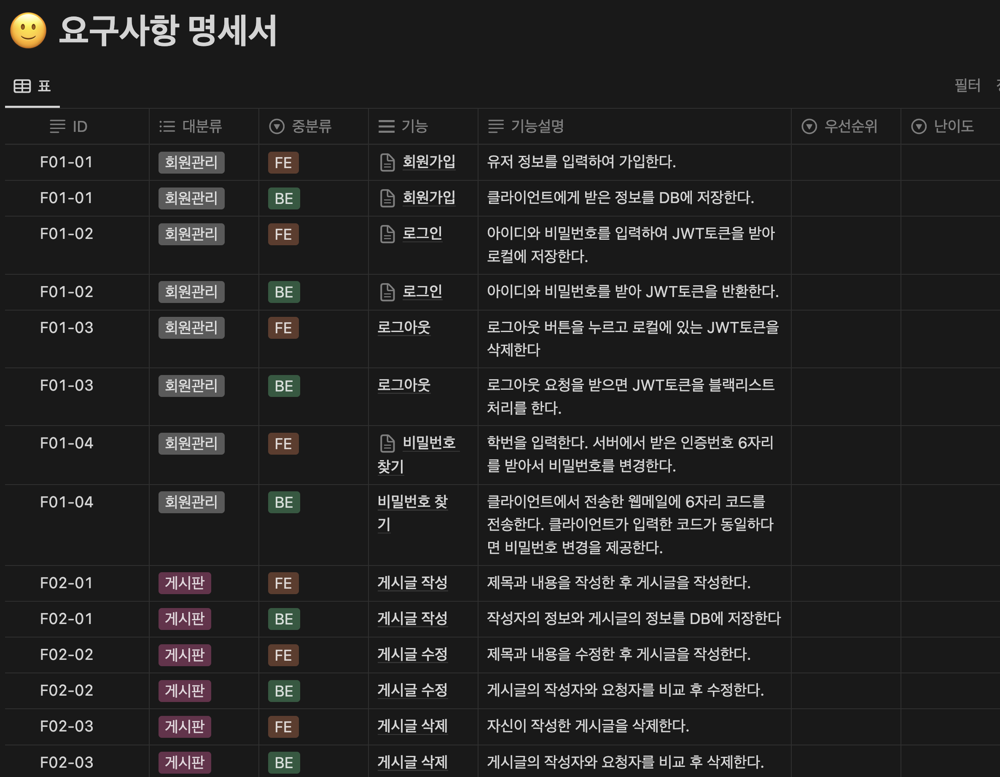

https://dark-porter-a0f.notion.site/fffb12859e594ef8a1b91cf63570a2bb?v=ed19286e6b7b4f7d984fb1a2ef435eae&pvs=4

# API 명세서

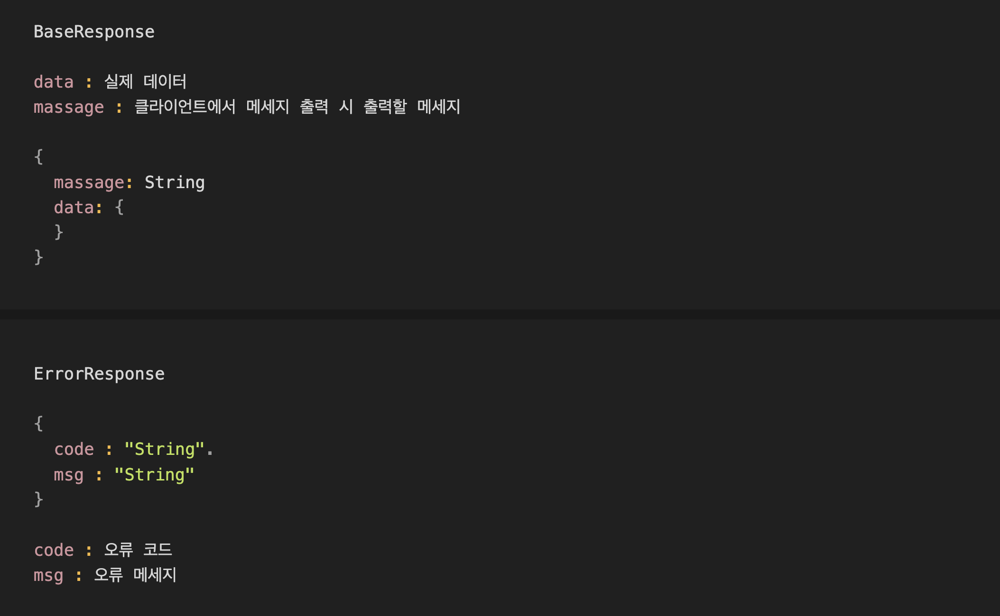

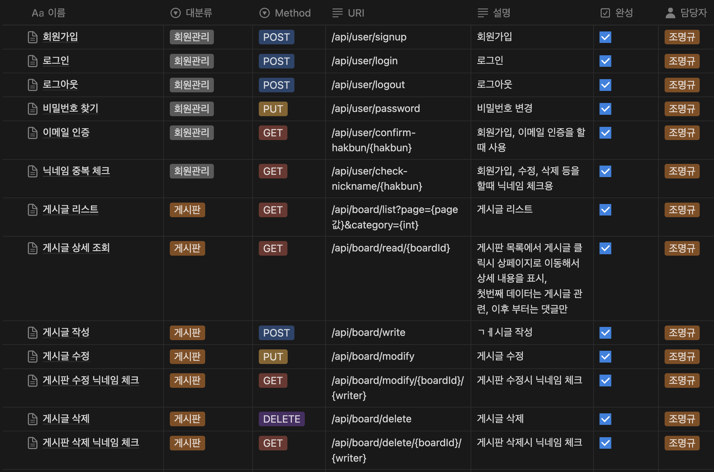

https://dark-porter-a0f.notion.site/API-09da39851de44bab8a075c75693ded05?pvs=4

# 작동 화면

## 로그인
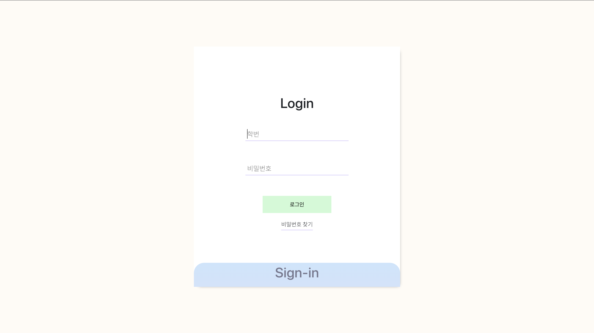

## 회원가입 이메일 인증
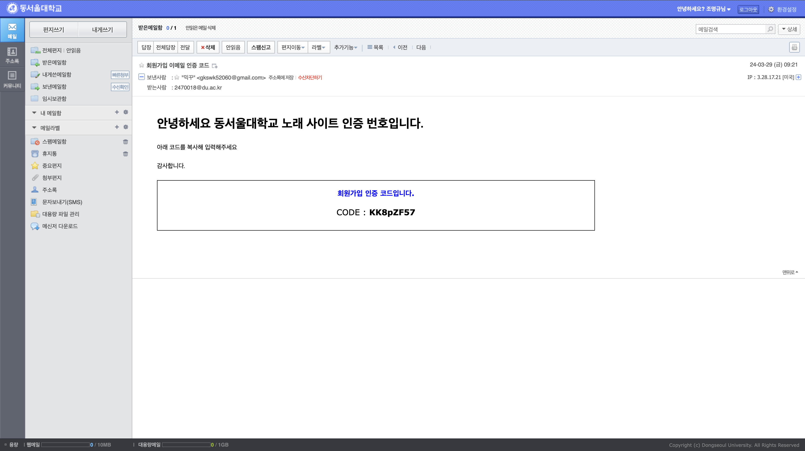

## 노래 통계( 금일신청내역, 특정 기간 노래 신청 내역)
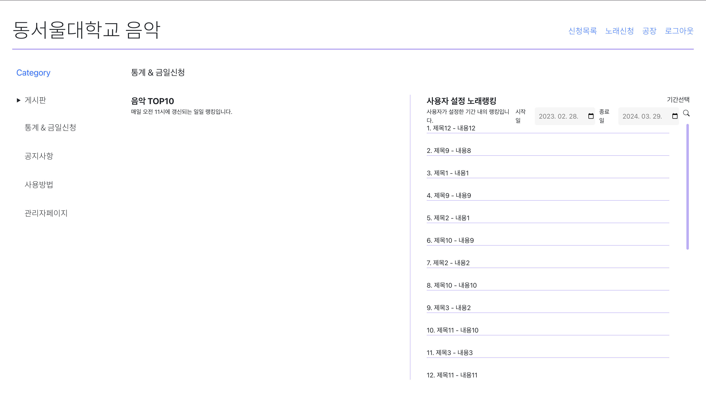

## 제목 검색
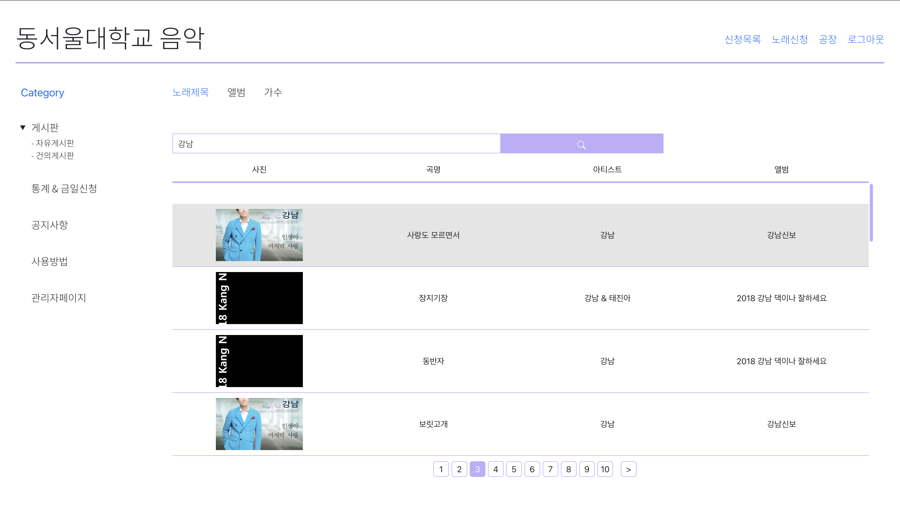

## 앨범 검색
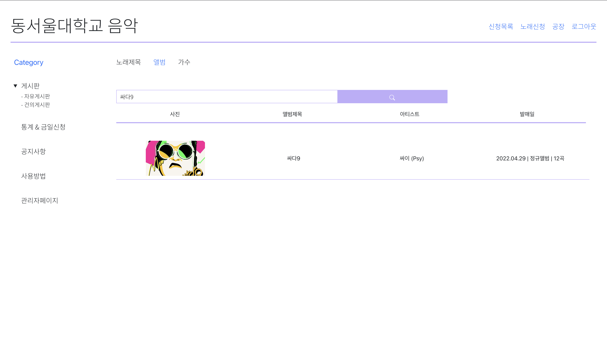

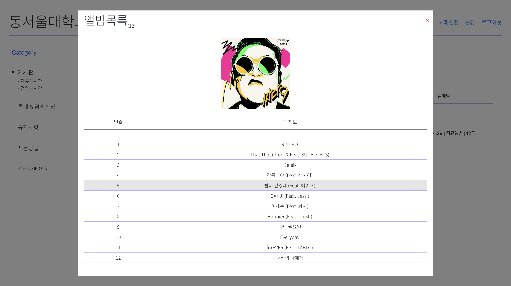

## 가수 검색
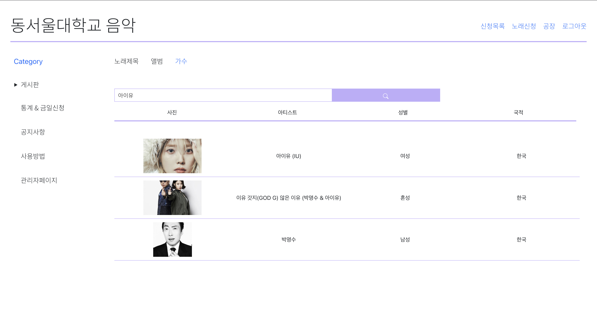

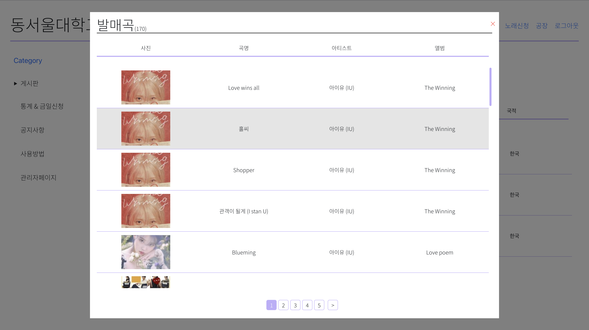

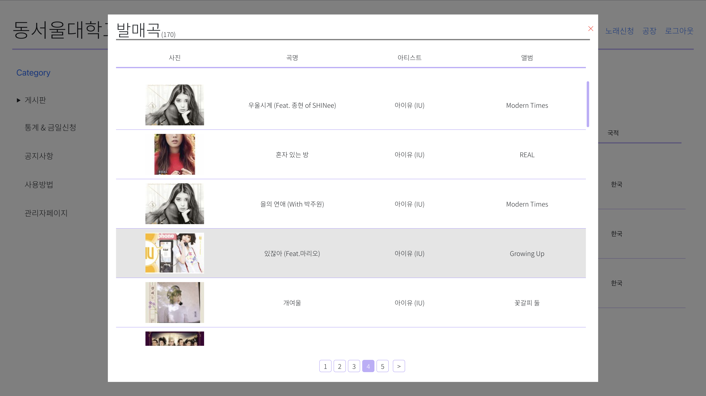

